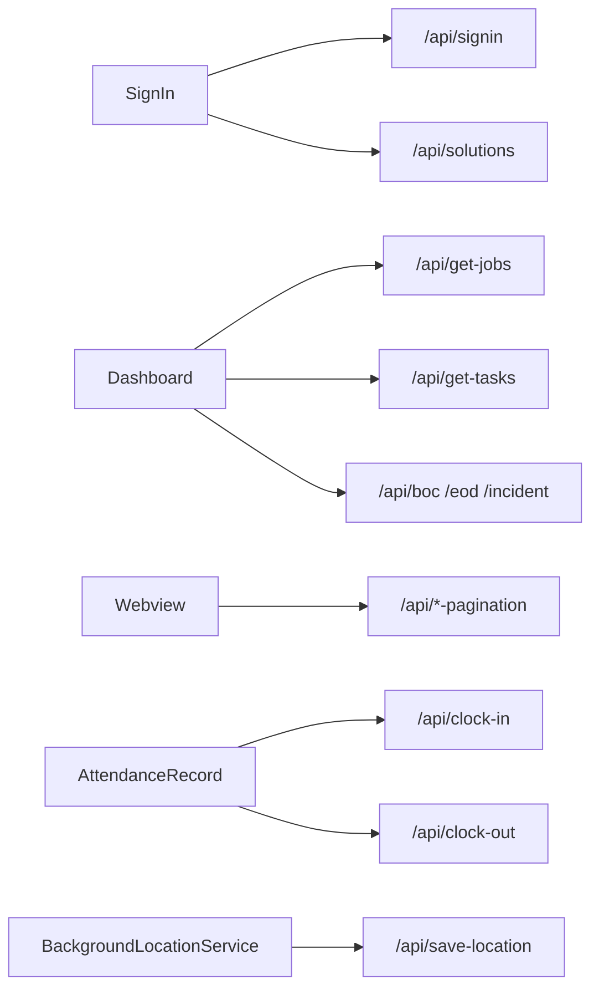

# CONTX API Calls Matrix

  ENDPOINT INVENTORY
  SOURCE-MAPPED
  AXIOS + FETCH

## 1. Host Map
| Host | Usage |
|---|---|
| `https://app.nexis365.com` | Primary REST API backend used across auth, jobs/tasks, CRM, documents, attendance, and menu metadata. |
| `https://www.nexis365.com/saas` | WebView target for SaaS pages and cookie/session bridging. |
| `http://192.168.1.195:3000` | Local/LAN endpoint used by notification token sync service. |
| `http://192.168.1.105:3000` | Local/LAN endpoint used by `MyComponent` legacy menu fetches. |

## 2. Authentication / Identity / Profile
| Method | Endpoint | Primary Call Sites |
|---|---|---|
| `POST` | `/api/signin` | `src/screens/auth/SignIn.js` |
| `GET` | `/api/solutions?ref_db=...` | `src/screens/auth/SignIn.js` |
| `GET` | `/api/get-profile?ref_db=...&userid=...` | `src/screens/Profile.js`, `src/screens/tabs/Dashboard.js` |
| `POST` | `/api/update-user-info?ref_db=...` | `src/screens/EditPersonalInfo.js` |
| `GET` | `/api/favicon` | `src/components/Header.js` |

## 3. Navigation Menu / Module APIs
| Method | Endpoint | Purpose |
|---|---|---|
| `POST` | `/api/modu` | Fetch module list + dashboard toggle state for modules. |
| `POST` | `/api/sidebarmenus` | Fetch solution list + dashboard toggle state. |
| `POST` | `/api/updateToggles` | Persist module dashboard toggle changes. |
| `POST` | `/api/updateToggle` | Persist solution dashboard toggle changes. |
| `POST` | `/api/sidebarmenu` | Fetch active sidebar menu hierarchy (level 1). |
| `POST` | `/api/modulesmenu` | Fetch module hierarchy (level 2). |
| `POST` | `/api/modulespmenu` | Fetch module hierarchy (level 3). |
| `POST` | `/api/modulespsmenu` | Fetch module hierarchy (level 4). |

## 4. Jobs / Tasks / Attendance Aggregates
| Method | Endpoint | Primary Call Sites |
|---|---|---|
| `GET` | `/api/get-jobs` | `MyJobs`, `tabs/Myjob`, `tabs/Timesheet`, `TimeSheet`, `Notifications`, `tabs/Dashboard` |
| `POST` | `/api/accept-job` | `MyJobs`, `tabs/Myjob`, `tabs/Dashboard` |
| `GET` | `/api/get-tasks` | `Task`, `tabs/Mytask`, `tabs/Dashboard`, `Notifications` |
| `POST` | `/api/update-task-status` | `Task`, `tabs/Mytask`, `tabs/Dashboard` |
| `GET` | `/api/recent-activity` | `tabs/Dashboard` |

## 5. Attendance / Field Forms (BOC, EOD, Incident)
| Method | Endpoint | Primary Call Sites |
|---|---|---|
| `GET` | `/api/get-project-teams` | `BocForm`, `EodForm`, `IncidentForm` |
| `GET` | `/api/insert-boc` | `BocForm` |
| `GET` | `/api/insert-eod` | `EodForm` |
| `POST` | `/api/insert-incident` | `IncidentForm` |
| `GET` | `/api/boc` | `tabs/Dashboard` |
| `GET` | `/api/eod` | `tabs/Dashboard` |
| `GET` | `/api/incident` | `tabs/Dashboard` |
| `GET` | `/api/boc-pagination` | `Webview` |
| `GET` | `/api/eod-pagination` | `Webview` |
| `GET` | `/api/incident-pagination` | `Webview` |
| `POST` | `/api/clock-in` | `AttendanceRecord` |
| `POST` | `/api/clock-out` | `AttendanceRecord` |
| `POST` | `/api/save-location` | `BackgroundLocationService` |

## 6. Lead / CRM / Document Entity Endpoints
| Entity | Create/Submit | List/Read | Update/Status |
|---|---|---|---|
| Campaign | `GET /api/campaigns-form` | `GET /api/get-campaigns` | `POST /api/update-campaign`, `POST /api/update-campaign-status` |
| Lead | `POST /api/leads-form` | `GET /api/get-leads` | `POST /api/update-lead`, `POST /api/update-leads-status` |
| Call | `POST /api/call` | `GET /api/get-calls` | `POST /api/update-call` |
| Email | `POST /api/email` | `GET /api/get-emails` | `POST /api/update-email` |
| Minutes | `POST /api/minutes` | `GET /api/get-minutes` | `POST /api/update-minute` |
| Cases | `POST /api/cases` | `GET /api/get-cases` | `POST /api/update-cases` |
| Quote | `POST /api/quote` | `GET /api/get-quotes` | `POST /api/update-quote` |
| Deal | `POST /api/deal` | `GET /api/get-deals` | `POST /api/update-deal` |
| Contract | `POST /api/contract` | `GET /api/get-contracts` | `POST /api/update-contract` |
| Document Category | `GET /api/category-form` | `GET /api/view-category` | via form modules |
| Document Module Metadata | `GET /api/get-modules`, `GET /api/get-parents-modules` | n/a | n/a |
| Document Upload | `POST /api/documents-form` | n/a | n/a |

## 7. Chatbot / QA
| Method | Endpoint | Notes |
|---|---|---|
| `POST` | `/api/qa` | Used in `tabs/Chatbot.js` when local canned Q/A does not match. |

## 8. Notification Service Endpoint (Non-primary Host)
| Method | Endpoint | Notes |
|---|---|---|
| `POST` | `http://192.168.1.195:3000/api/update-fcm` | Development/LAN endpoint in `src/services/notificationService.js`; not production-safe as-is. |

## 9. API Flow Visual

## 10. API Design Characteristics in Current Code
- No centralized API client abstraction; endpoints are hardcoded across many files.
- Auth/session state is mostly AsyncStorage-driven, not token-interceptor-driven.
- Query/body parameter shapes are repeated and manually built.
- WebView route construction often derives page names from menu labels.

## 11. Raw Extraction File
For complete line-level endpoint extraction:
- `CONTX_API_ENDPOINTS_RAW.txt`
