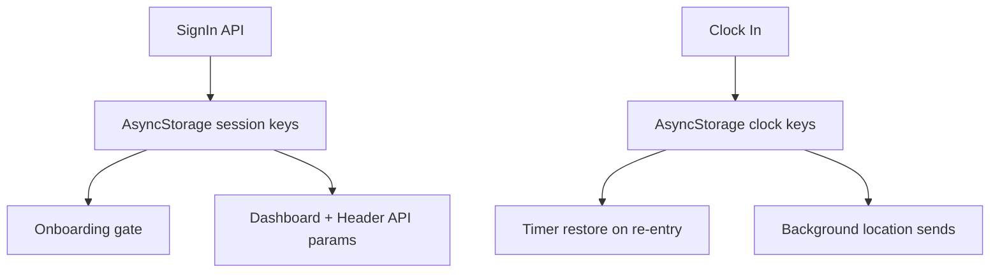

# CONTX Data And State Model

  STATE MODEL
  REDUX + CONTEXT + ASYNCSTORAGE

## 1. State Layers

### Layer A: Redux (global UI state)
- Store: `src/store/store.js`
- Slice: `src/store/tabSlice.js`
- Key state:
  - `tab.screen` (default `Home`)
- Use-case: controls custom tab renderer in `TabNavigator`.

### Layer B: React Context Providers
Declared in `App.jsx` wrapper stack:
1. `UserProvider`
2. `MenuProvider`
3. `TaskProvider`
4. `PendingProvider`
5. Redux `Provider`
6. `ThemeProvider`
7. `LoaderProvider`

Context responsibilities:
- `ThemeContext`: light/dark theme toggle and value.
- `LoaderContext`: global loading flag helpers.
- `MenuContext`: refresh toggle to force menu re-fetch in header flows.
- `TaskContext`: `todayTaskCount` for dashboard widgets.
- `PendingContext`: pending task count across dashboards.
- `UserContext`: persisted `userToken` hydration.

### Layer C: AsyncStorage (session + workflow persistence)
Used heavily for user identity, menu context, and attendance continuity.

## 2. High-Value AsyncStorage Keys
| Key | Typical Purpose |
|---|---|
| `ref_db` | Tenant/database selector sent in almost all API requests. |
| `secondaryId` | Current user ID (secondary DB). |
| `secondaryUnbox` | User identity used in menu/module API posts. |
| `secondaryUsername2` / `secondaryUsername` | Display/user identity labels. |
| `application` | Stored app module names from `/api/solutions`. |
| `userToken` | login/session flag used by onboarding gating. |
| `currentJobId` | Active attendance job reference. |
| `lastClockIn` | Timestamp for elapsed timer recovery. |
| `elapsedTime` | Persisted elapsed clock timer value. |
| `attendance_records` | Local attendance event list backup. |
| `fcmToken` | Push token cache. |

Full key extraction with source references:
- `CONTX_ASYNCSTORAGE_KEYS_RAW.txt`

## 3. Session Lifecycle (Observed)

### Sign-in writes
`auth/SignIn.js` stores identity bundle:
- `saasid`, `unbox`, `ref_db`, `secondaryId`, `secondaryUnbox`, `secondaryUsername2`, `secondaryUsername`, `secondaryEmail`, `secondaryPhone`, `userToken`, `application`

### Onboarding gate reads
`Onboarding.js` reads:
- `hasSeenOnboarding`, `userToken`

### Header/dashboard reads
- Reads user/module keys repeatedly for menu composition and profile identity rendering.

### Attendance persistence
`AttendanceRecord.js` uses:
- `currentJobId`, `lastClockIn`, `isClockedIn`, `elapsedTime`, `attendance_records`

## 4. Data Flow Visual

## 5. Coupling Characteristics
- Strong coupling between network layer and AsyncStorage keys (`ref_db`, `secondaryId`) in many screens.
- No centralized typed storage contract; keys are string literals distributed across files.
- Same keys are read/written in many places, increasing drift risk.

## 6. Suggested Normalization Targets
- Create a single storage key constants module.
- Create one `sessionStore` abstraction for read/write/clear.
- Move API param assembly (`ref_db`, `userid`) into reusable helpers.
