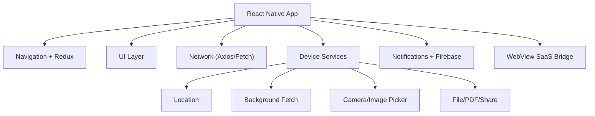

# CONTX Dependencies And Stack

  STACK PROFILE
  DEPENDENCY GROUPED

## 1. Runtime Platform Versions
- React: `18.2.0`
- React Native: `0.71.6`
- Node target: `18` (`.node-version`)
- Android Gradle Plugin: `7.3.1`
- Android compile/target SDK: `33`
- Hermes: enabled

## 2. Dependency Groups

### Core app/runtime
- `react`
- `react-native`
- `@react-navigation/native`
- `@react-navigation/native-stack`
- `@reduxjs/toolkit`
- `react-redux`

### Data and validation
- `axios`
- `@react-native-async-storage/async-storage`
- `formik`
- `yup`
- `uuid`
- `react-native-uuid`

### UI and rendering
- `react-native-paper`
- `react-native-svg`
- `react-native-vector-icons`
- `react-native-fast-image`
- `react-native-keyboard-aware-scroll-view`
- `react-native-linear-gradient`
- `react-native-modal`
- `react-native-snap-carousel`
- `react-native-responsive-dimensions`
- `@gorhom/bottom-sheet`

### File/media/document
- `react-native-image-picker`
- `react-native-document-picker`
- `react-native-file-viewer`
- `react-native-fs`
- `react-native-html-to-pdf`
- `react-native-share`

### Location/background
- `@react-native-community/geolocation`
- `react-native-location`
- `react-native-background-fetch`
- `react-native-background-actions`
- `@supersami/rn-foreground-service`
- `react-native-permissions`
- `@react-native-community/netinfo`

### Messaging/notifications
- `@react-native-firebase/app`
- `@react-native-firebase/messaging`
- `react-native-push-notification`

### Web and voice
- `react-native-webview`
- `@react-native-voice/voice`

## 3. Dev Toolchain
- Babel/Jest/TS lint stack present:
  - `@babel/core`, `babel-jest`
  - `jest`, `react-test-renderer`
  - `typescript` (but codebase is primarily JS)
  - `eslint`, `@react-native-community/eslint-config`
  - `prettier`

## 4. Script Surface
From `package.json`:
- `android`: run Android app
- `ios`: run iOS app
- `start`: Metro
- `lint`: ESLint
- `test`: Jest

## 5. Native Packaging Notes
### Android
- Uses Firebase BOM and explicit analytics/messaging dependency.
- Applies `com.google.gms.google-services` plugin.

### iOS
- Podfile uses default RN pod integration with optional Flipper.
- Hermes/fabric flags from RN defaults.

## 6. Dependency Hygiene Observations
Potential cleanup candidates:
- `"-": "^0.0.1"` appears invalid/suspicious.
- `pod` and `force` in npm deps appear unusual for runtime.
- legacy or low-confidence packages should be reviewed for necessity.

## 7. Suggested Future Hardening (Dependency Focus)
- Centralize and pin critical infra dependencies for reproducible builds.
- Remove unused or suspicious packages after import-level audit.
- Introduce security and license scanning in CI.

## 8. Ecosystem Visualization

