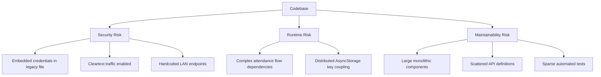

# CONTX Gaps And Risks

  RISK REGISTER
  SECURITY + MAINTAINABILITY

## 1. Critical / High-Risk Findings

### A. Legacy server code and credentials in app repo
- `src/screens/webview2.js` contains server-side style code (`express`, `mysql`, `bcrypt`, credentials literals).
- Contains DB credential literals and backend route logic in a client repository context.
- Risk: accidental exposure, credential leakage, supply-chain and audit failures.

### B. Hardcoded local/LAN API URLs in tracked source
- `http://192.168.1.195:3000/api/update-fcm`
- `http://192.168.1.105:3000/api/*`
- Risk: non-portable builds, environment drift, potential MITM/local network assumptions.

### C. Cleartext traffic enabled on Android
- `android:usesCleartextTraffic="true"` in manifest.
- Risk: plaintext HTTP allowance at runtime.

### D. Release signing profile uses debug keystore config
- `android/app/build.gradle` release block points to debug signing config.
- Risk: production release process not hardened.

## 2. Medium-Risk Findings

### A. API surface is scattered and uncoupled
- Endpoints are directly hardcoded in many files.
- No centralized axios client/interceptor/base URL contract.
- Risk: drift, inconsistent error handling, difficult environment switching.

### B. Info.plist duplication/inconsistency
- Duplicate location usage keys and an empty location description entry.
- Risk: review friction, policy rejection risk in stricter app-store checks.

### C. Package dependency hygiene issues
- Suspicious dependency entry `"-": "^0.0.1"`.
- Possible unused/legacy runtime packages (`pod`, `force`, others).
- Risk: inflated attack surface, audit complexity.

### D. Large monolithic screens/components
- `tabs/Dashboard.js`, `Header.js`, `LeadForm.js`, `IncidentForm.js`, `EodForm.js` are highly dense.
- Risk: fragile modifications, hidden regressions, difficult testability.

## 3. Functional Reliability Risks
- Multiple flows depend on AsyncStorage keys existing exactly as expected.
- Attendance path mixes camera, location, background fetch, and API calls with minimal fallback orchestration.
- WebView route generation depends on string transforms of menu labels.

## 4. QA/Test Coverage Risks
- Only baseline render test exists in `__tests__/App-test.tsx`.
- No focused tests for:
  - Auth/session persistence
  - Attendance lifecycle (clock-in/out)
  - API error handling per domain
  - Navigation transition correctness

## 5. Risk Prioritization
| Priority | Item |
|---|---|
| P0 | Remove/relocate sensitive backend logic and credentials from `webview2.js`. |
| P1 | Replace hardcoded LAN endpoints with environment-configured base URLs. |
| P1 | Disable cleartext traffic unless strictly required and isolated. |
| P1 | Establish production signing config. |
| P2 | Centralize API client + storage keys. |
| P2 | Break up monolithic screens/components and add targeted tests. |
| P3 | Dependency pruning and strict lint/static checks for unsafe artifacts. |

## 6. Suggested Hardening Sequence
1. Secrets and legacy server code cleanup.
2. Networking hardening (base URL config + TLS-only policy).
3. Release config hardening.
4. State/API abstraction cleanup.
5. Test coverage for mission-critical flows.

## 7. Visual Risk Map

