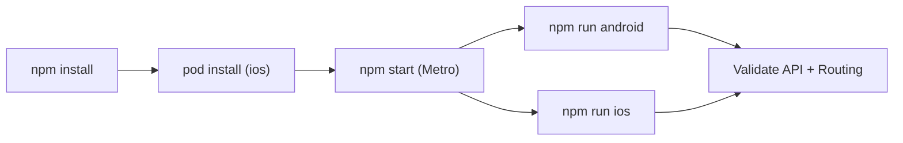

# CONTX How To Run (Root-Level Comprehensive)

<div align="center">
  <span style="background:#1f6feb;color:#fff;padding:4px 10px;border-radius:999px;font-weight:700;">RUNBOOK</span>
  <span style="background:#2ea043;color:#fff;padding:4px 10px;border-radius:999px;font-weight:700;">ANDROID + IOS</span>
  <span style="background:#d29922;color:#111;padding:4px 10px;border-radius:999px;font-weight:700;">RN 0.71.6</span>
</div>

## 1. Prerequisites

### Mandatory
- Node.js `18` (from `.node-version`)
- npm (project uses `package-lock.json`)
- Watchman (recommended on macOS)
- Xcode (for iOS builds)
- Android Studio + Android SDK (for Android builds)

### Native toolchains
- Ruby `>= 2.6.10` (`Gemfile`)
- CocoaPods `>= 1.11.3` (`Gemfile`)
- Java JDK 11+ compatible with AGP 7.3.1

### Mobile platform accounts/config
- Firebase config files should exist for notifications:
  - Android: `android/app/google-services.json`
  - iOS (if used): ensure plist/project setup is complete

## 2. Install Dependencies
```bash
cd /Users/moofasa/Nexis_app
npm install
```

For iOS pods:
```bash
cd /Users/moofasa/Nexis_app/ios
bundle install
bundle exec pod install
cd /Users/moofasa/Nexis_app
```

If you skip Bundler, fallback:
```bash
cd /Users/moofasa/Nexis_app/ios
pod install
cd /Users/moofasa/Nexis_app
```

## 3. Start Metro
```bash
cd /Users/moofasa/Nexis_app
npm start
```

Keep Metro running in one terminal.

## 4. Run Android
```bash
cd /Users/moofasa/Nexis_app
npm run android
```

### Android quick checks
- Package: `com.nexis365.saas`
- Gradle plugin: `7.3.1`
- Compile/Target SDK: `33`
- Hermes: enabled (`android/gradle.properties` + app/build.gradle)

## 5. Run iOS
```bash
cd /Users/moofasa/Nexis_app
npm run ios
```

If CocoaPods errors appear, reinstall pods:
```bash
cd /Users/moofasa/Nexis_app/ios
rm -rf Pods Podfile.lock
pod install
cd /Users/moofasa/Nexis_app
npm run ios
```

## 6. First-Run Functional Checks

### Auth and onboarding
1. Confirm splash -> onboarding -> sign-in flow.
2. Login should store `ref_db`, `secondaryId`, and `userToken` in AsyncStorage.

### API reachability
- Validate calls to `https://app.nexis365.com/api/*` from sign-in and dashboard.

### Notifications
- Verify FCM permission prompts on app startup (`App.jsx`).
- Confirm local push channel creation (`background-location`).

### Location/background
- Test attendance clock-in/out with camera + location permission.
- Verify background fetch starts after clock-in and stops after clock-out.

## 7. Environment Notes

### No explicit `.env` contract in app code
Most endpoints are hardcoded in screens/components. If you need multi-env support, centralize base URLs before scaling CI/CD.

### Network behavior
- Android manifest sets `android:usesCleartextTraffic="true"`.
- Code includes hardcoded LAN URLs (development residue):
  - `http://192.168.1.195:3000/api/update-fcm`
  - `http://192.168.1.105:3000/api/...`

## 8. Typical Development Workflow


## 9. Troubleshooting

### Metro cache issues
```bash
cd /Users/moofasa/Nexis_app
npx react-native start --reset-cache
```

### Android clean build
```bash
cd /Users/moofasa/Nexis_app/android
./gradlew clean
cd /Users/moofasa/Nexis_app
npm run android
```

### iOS DerivedData cleanup
```bash
rm -rf ~/Library/Developer/Xcode/DerivedData
cd /Users/moofasa/Nexis_app/ios
pod install
cd /Users/moofasa/Nexis_app
npm run ios
```

### Pods with Ruby mismatch
Use Bundler to force Gemfile versions:
```bash
cd /Users/moofasa/Nexis_app/ios
bundle exec pod install
```

## 10. Useful NPM Scripts
From `package.json`:
- `npm run start` -> `react-native start`
- `npm run android` -> `react-native run-android`
- `npm run ios` -> `react-native run-ios`
- `npm run test` -> `jest`
- `npm run lint` -> `eslint .`

## 11. CI/CD Readiness Notes
- App name is still generic (`app`) in `app.json` and registration.
- Dependency list contains suspicious legacy entries (`"-": "^0.0.1"`, `pod`, `force`).
- Security hardening is needed before production CI rollout.

For architecture and risk detail:
- `CONTX_REPOSITORY_MAP.md`
- `CONTX_ROUTING_AND_FLOW.md`
- `CONTX_GAPS_AND_RISKS.md`
