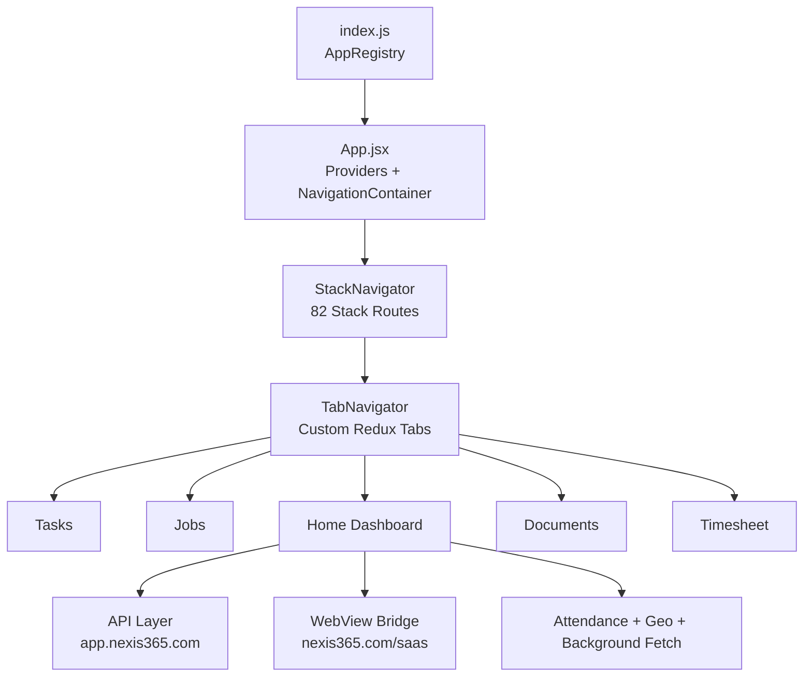

# CONTX Repository Context Hub

  AI + HUMAN READABLE
  STRUCTURED
  VERBOSE CONTEXT
  ROOT LEVEL DOC SET

## What This Is
This repository now has a full context package using the naming rule `CONTX_(name).md/txt`.
Use this file as the top-level entry point.

## Document Map
| File | Purpose | Audience |
|---|---|---|
| `CONTX_MASTER_CONTEXT.txt` | Single-file plain-text snapshot for LLM ingestion and fast human scanning. | AI + Human |
| `CONTX_HOW_TO_RUN.md` | Full local setup, prerequisites, run commands, troubleshooting. | Human |
| `CONTX_HOW_TO_RUN.txt` | Plain-text execution runbook for terminals and agents. | AI + Human |
| `CONTX_REPOSITORY_MAP.md` | Folder-by-folder explanation of root, `src`, `android`, `ios`. | AI + Human |
| `CONTX_ROUTING_AND_FLOW.md` | Stack routes, tab flow, navigation relationships, journey diagrams. | AI + Human |
| `CONTX_API_CALLS_MATRIX.md` | Endpoint inventory, where each API is called, purpose and patterns. | AI + Human |
| `CONTX_FUNCTIONS_INDEX.md` | Functional architecture and high-impact function groups. | AI + Human |
| `CONTX_DEPENDENCIES_AND_STACK.md` | Dependency catalog by category and runtime significance. | AI + Human |
| `CONTX_NATIVE_ANDROID.md` | Android-native build/runtime config and background services notes. | Human |
| `CONTX_NATIVE_IOS.md` | iOS-native setup, Pod/Xcode/config details. | Human |
| `CONTX_SCREEN_CATALOG.md` | Screen catalog with complexity and behavior grouping. | AI + Human |
| `CONTX_DATA_AND_STATE.md` | Redux, Context, AsyncStorage keys, state lifecycles. | AI + Human |
| `CONTX_GAPS_AND_RISKS.md` | Architectural, security, maintainability, and runtime risk notes. | Tech Lead |
| `CONTX_LAST_COMMIT_UPDATE.md` | Audited summary of the latest commit (scope, semantic deltas, hotspots). | AI + Human |
| `CONTX_API_ENDPOINTS_RAW.txt` | Raw auto-extracted API call rows. | AI |
| `CONTX_ROUTE_TARGETS_RAW.txt` | Raw auto-extracted navigation transitions. | AI |
| `CONTX_FUNCTIONS_RAW.txt` | Raw function definition inventory. | AI |
| `CONTX_ASYNCSTORAGE_KEYS_RAW.txt` | Raw AsyncStorage key scan. | AI |
| `CONTX_SCREEN_METRICS_RAW.txt` | Raw screen size/API usage metrics. | AI |
| `CONTX_LAST_COMMIT_FILES_RAW.txt` | Raw name-status file list for latest commit. | AI |
| `CONTX_LAST_COMMIT_TOP_DELTA.txt` | Raw line-churn ranking for latest commit. | AI |

## Quick Architecture Visual

## Start Order Recommendation
1. Read `CONTX_MASTER_CONTEXT.txt`.
2. Read `CONTX_HOW_TO_RUN.md` and verify environment.
3. Read `CONTX_ROUTING_AND_FLOW.md` + `CONTX_API_CALLS_MATRIX.md`.
4. Read `CONTX_LAST_COMMIT_UPDATE.md` for latest-commit deltas.
5. Use raw files when scripting analysis or building agents.
