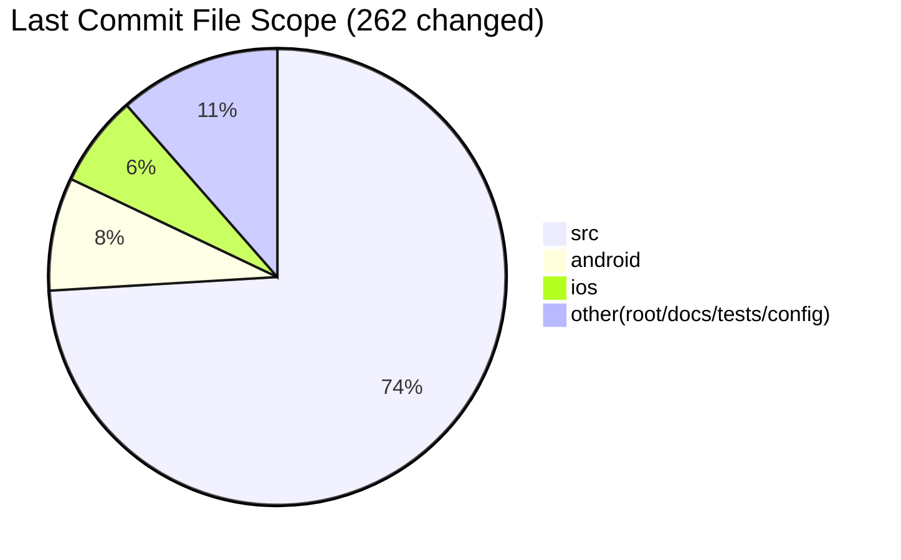
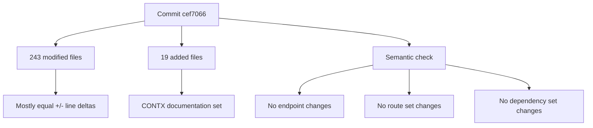

# CONTX Last Commit Update

  COMMIT AUDIT
  DOCS UPDATED
  MASS-CHANGE REVIEW

## Commit Reviewed
- Hash: `cef706644836cb4c7ecfb51493768c082a9a19bf`
- Short: `cef7066`
- Subject: `dev update`
- Author: `Farhan`
- Author Date: `2026-02-10 08:09:31 +1100`

## High-Level Delta
- Files changed: `262`
- Modified: `243`
- Added: `19`
- Insertions: `59,518`
- Deletions: `56,873`

## Change Pattern Interpretation
- `243 / 262` files have **equal insertions and deletions**.
- This strongly indicates large-scale formatting/EOL normalization churn on existing files.
- The `19` added files are the `CONTX_*` documentation files.

## Top-Level Change Distribution
- `src`: `194` files
- `android`: `21` files
- `ios`: `17` files
- root/config/docs/tests: remaining files

## File-Type Distribution (Changed)
- `.js`: `198`
- `.md`: `12`
- `.json`: `8`
- `.txt`: `7`
- `.xml`: `6`
- `.java`: `4`

## Largest File Deltas (By Line Churn)
1. `package-lock.json` (`+20656/-20656`, delta `41312`)
2. `src/screens/webview2.js` (`+2898/-2898`, delta `5796`)
3. `android/app/src/main/assets/index.android.bundle` (`+1723/-1723`, delta `3446`)
4. `src/screens/tabs/Dashboard.js` (`+1195/-1195`, delta `2390`)
5. `src/components/Header.js` (`+1077/-1077`, delta `2154`)

Full ranked list:
- `CONTX_LAST_COMMIT_TOP_DELTA.txt`

## Semantic Delta Checks (HEAD^ -> HEAD)
Checked directly from source extraction:
- Endpoints before/after: `58 -> 58`
- Endpoint additions/removals: `0 / 0`
- Stack routes before/after: `82 -> 82`
- Route additions/removals: `0 / 0`
- Runtime dependency count before/after: `61 -> 61`
- Dependency add/remove/version-change: `0 / 0 / 0`

### Practical Conclusion
The last commit is primarily a large formatting/normalization + documentation addition commit, with **no net API/route/dependency-set changes** detected.

## Raw Audit Artifacts
- `CONTX_LAST_COMMIT_FILES_RAW.txt`
- `CONTX_LAST_COMMIT_TOP_DELTA.txt`

## Visual Summary

