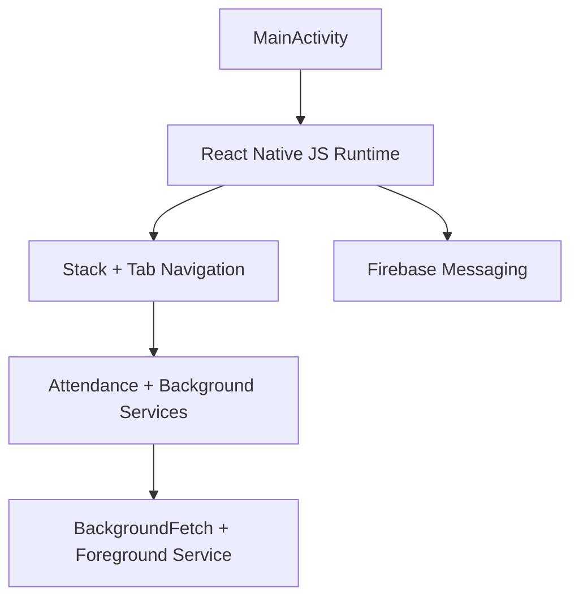

# CONTX Native Android Context

<div align="center">
  <span style="background:#3ddc84;color:#111;padding:4px 10px;border-radius:999px;font-weight:700;">ANDROID</span>
  <span style="background:#0f172a;color:#fff;padding:4px 10px;border-radius:999px;font-weight:700;">GRADLE + MANIFEST</span>
</div>

## 1. Build Identity
- Namespace: `com.nexis365.saas`
- Application ID: `com.nexis365.saas`
- Compile SDK: `33`
- Target SDK: `33`
- Min SDK: `23`
- Hermes: enabled

Files:
- `android/build.gradle`
- `android/app/build.gradle`
- `android/gradle.properties`

## 2. Key Build Configuration Notes

### Root Gradle (`android/build.gradle`)
- Plugin classpaths include:
  - Android Gradle plugin `7.3.1`
  - React Native Gradle plugin `0.71.6`
  - Google Services plugin `4.3.14`
- Includes custom maven path for `react-native-background-fetch` libs.

### App Gradle (`android/app/build.gradle`)
- Firebase BOM `33.5.1`
- Messaging dependency `com.google.firebase:firebase-messaging:23.4.1`
- Flipper debug dependencies enabled.
- ABI split logic present but disabled by default (`enableSeparateBuildPerCPUArchitecture=false`).
- Uses debug signing for release currently (not production-ready).

## 3. Manifest Permissions and Services
Primary permissions in `android/app/src/main/AndroidManifest.xml`:
- `INTERNET`
- `WAKE_LOCK`
- `ACCESS_FINE_LOCATION`
- `ACCESS_COARSE_LOCATION`
- `ACCESS_BACKGROUND_LOCATION`
- `FOREGROUND_SERVICE`
- `RECEIVE_BOOT_COMPLETED`
- `READ_EXTERNAL_STORAGE`
- `WRITE_EXTERNAL_STORAGE`
- `READ_MEDIA_IMAGES`
- `RECORD_AUDIO`
- `POST_NOTIFICATIONS`

Notable app flags:
- `android:usesCleartextTraffic="true"`
- `android:allowBackup="false"`

Declared services/receivers include:
- RN Background Fetch headless task service/receiver
- Foreground service package (`com.supersami.foregroundservice.*`)
- Background actions service
- RN permissions service
- Firebase messaging service + receiver

## 4. Native Entry Classes
- `MainApplication.java`
  - Standard RN host setup.
  - Flipper init for debug.
  - New architecture toggle support.

- `MainActivity.java`
  - Sends Android intent notification click data back to JS via `notificationClickHandle` event.

## 5. Android Runtime Integration Notes
- Push/local notification channels configured in JS (`App.jsx`).
- Background location stage tracking lives partly in JS (`BackgroundLocationService.js`).
- Attendance flow expects camera + location + background execution reliability.

## 6. Operational Risks (Android)
- Cleartext traffic enabled globally.
- Debug signing used for release profile in current gradle config.
- Large resource footprint under `res/drawable-*` (bundled/generated assets) increases APK size.

## 7. Android Build Commands
```bash
cd /Users/moofasa/Nexis_app
npm run android
```

Clean:
```bash
cd /Users/moofasa/Nexis_app/android
./gradlew clean
```

## 8. Android Layer Visual

