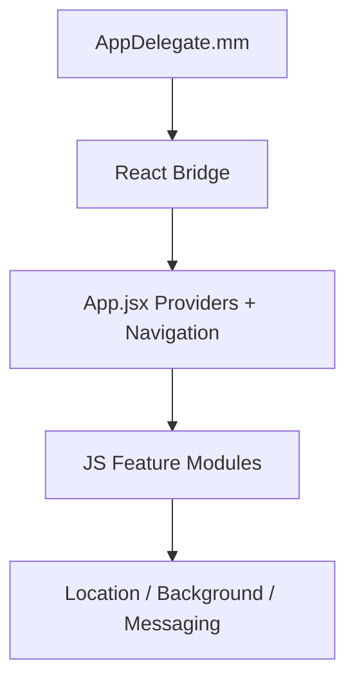

# CONTX Native iOS Context

<div align="center">
  <span style="background:#111827;color:#fff;padding:4px 10px;border-radius:999px;font-weight:700;">iOS</span>
  <span style="background:#2563eb;color:#fff;padding:4px 10px;border-radius:999px;font-weight:700;">PODS + XCODE</span>
</div>

## 1. Core Files
- `ios/Podfile`
- `ios/app/AppDelegate.mm`
- `ios/app/Info.plist`
- `ios/app.xcodeproj/project.pbxproj`
- `ios/app.xcodeproj/xcshareddata/xcschemes/app.xcscheme`

## 2. Podfile Summary
- Uses RN helper scripts:
  - `react_native_pods`
  - `@react-native-community/cli-platform-ios/native_modules`
- Flipper configurable via `NO_FLIPPER` env.
- `use_react_native!` with Hermes/Fabric flags from RN defaults.
- Includes post-install RN hooks and M1 workaround.

## 3. App Delegate Summary
`AppDelegate.mm` behavior:
- Sets `moduleName = "app"`.
- Uses bundle URL from Metro in debug and `main.jsbundle` in release.
- `concurrentRootEnabled` returns `true`.

## 4. Info.plist Runtime Declarations
Observed important keys:
- Location usage descriptions (`NSLocationWhenInUseUsageDescription`, `NSLocationAlwaysUsageDescription`, `NSLocationAlwaysAndWhenInUseUsageDescription`)
- Background modes include:
  - `location`
  - `fetch`
- Microphone/Speech usage descriptions present.
- App transport exceptions for `localhost` insecure HTTP loads.
- Custom fonts listed under `UIAppFonts`.

Observation:
- Duplicate/repeated location keys appear in plist and one later `NSLocationWhenInUseUsageDescription` is empty.

## 5. iOS Runtime Integration Notes
- iOS side is mostly standard RN bootstrap; most behavior is implemented in JS.
- Background/location/notification runtime behaviors depend heavily on JS module handling and permissions.

## 6. Build + Run Commands
Install pods:
```bash
cd /Users/moofasa/Nexis_app/ios
bundle install
bundle exec pod install
```

Run app:
```bash
cd /Users/moofasa/Nexis_app
npm run ios
```

## 7. iOS Troubleshooting
If Xcode build errors persist:
```bash
rm -rf ~/Library/Developer/Xcode/DerivedData
cd /Users/moofasa/Nexis_app/ios
rm -rf Pods Podfile.lock
pod install
cd /Users/moofasa/Nexis_app
npm run ios
```

## 8. iOS Layer Visual

