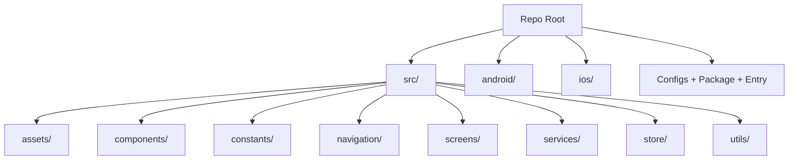

# CONTX Repository Map (Folder-by-Folder)

<div align="center">
  <span style="background:#0550ae;color:#fff;padding:4px 10px;border-radius:999px;font-weight:700;">STRUCTURE MAP</span>
  <span style="background:#1a7f37;color:#fff;padding:4px 10px;border-radius:999px;font-weight:700;">ROOT + SRC + NATIVE</span>
</div>

## High-Level Tree
```text
Nexis_app/
├── App.jsx
├── index.js
├── package.json
├── android/
├── ios/
├── src/
├── __tests__/
├── .bundle/
├── .vscode/
└── CONTX_*.md / CONTX_*.txt
```

## Root Directory Breakdown
| Path | Role |
|---|---|
| `App.jsx` | Application runtime root: providers, push notification channel config, Firebase messaging handlers, location config, navigation root component. |
| `index.js` | React Native entrypoint; registers the app component. |
| `app.json` | App display metadata (`name` and `displayName` currently `app`). |
| `package.json` | Dependency and scripts manifest. |
| `package-lock.json` | npm lockfile. |
| `babel.config.js` | Babel preset + reanimated plugin. |
| `metro.config.js` | Metro bundler config. |
| `react-native.config.js` | RN config including linked font assets from `src/assets/fonts`. |
| `Gemfile` / `Gemfile.lock` | Ruby/CocoaPods dependency management for iOS. |
| `.eslintrc.js` / `.prettierrc.js` | Lint and formatting rules. |
| `.node-version` | Node target version (`18`). |
| `.bundle/` | Bundler local configuration (`vendor/bundle`). |
| `.vscode/` | Editor-level settings. |
| `__tests__/` | Jest baseline render test. |
| `android/` | Native Android project files and resources. |
| `ios/` | Native iOS Xcode project files. |

## `src/` Breakdown

### `src/assets/` (145 files)
Purpose: Visual and typographic assets.
- `bg/`, `cards/`, `images/`, `login/`, `profile/`, `favicon/`, `icons/` contain static raster art.
- `fonts/` includes SourceSansPro variants.
- `svg/` includes React component wrappers for iconography and UI glyphs.

### `src/components/` (20 files)
Purpose: shared UI building blocks.
- Key files:
  - `Header.js`: high-impact reusable top bar with side menu API integrations.
  - `InputField.js`, `Button.js`, `Dropdown.js`: form primitives.
  - `Loader.js`, `SwitchButton.js`, `BlockHeading.js`.
- `components/custom/`: wrappers (`SafeAreaView`, `Image`, `ImageBackground`, `StatusBar`).
- `components/text/`: typography components (`H1-H5`, `T14`, `T16`).

### `src/constants/` (8 files)
Purpose: global theme/constants and context state providers.
- `theme.js`: color/font/spacing tokens.
- Contexts:
  - `ThemeContext.js`
  - `LoaderContext.js`
  - `MenuContext.js`
  - `TaskContext.js`
  - `PendingContext.js`
  - `UserContext.js`

### `src/navigation/` (2 files)
Purpose: navigation topology.
- `StackNavigator.js`: stack route registry (82 declared routes).
- `TabNavigator.js`: custom bottom tab implementation using Redux `tab.screen`.

### `src/screens/` (95 files)
Purpose: application features and workflows.
- Includes auth, dashboard, jobs/tasks, attendance, documents, leads/campaigns, payment/card flows, chatbot, utilities.
- Contains subfolders:
  - `screens/auth/` for sign in/up flows.
  - `screens/tabs/` for tab-local content screens.

### `src/services/` (1 file)
Purpose: service-level helper logic.
- `notificationService.js`: FCM permission/token handling + token sync endpoint.

### `src/store/` (2 files)
Purpose: Redux store.
- `tabSlice.js`: stores active tab selection.
- `store.js`: configureStore setup.

### `src/utils/` (1 file)
Purpose: utility helpers.
- `permissions.js`: location permission request helper.

## `android/` Breakdown

### Root Android files
| Path | Role |
|---|---|
| `android/build.gradle` | Root Gradle config + SDK versions + google-services plugin classpath. |
| `android/settings.gradle` | Android project includes. |
| `android/gradle.properties` | Hermes/new architecture/Flipper and Gradle JVM options. |
| `android/app/build.gradle` | App module build config, dependencies, app ID, signing, Firebase messaging deps. |

### `android/app/src/main/`
- `AndroidManifest.xml`: permissions and service declarations.
- `java/com/app/` holds Java classes (`MainActivity`, `MainApplication`).
- `res/` contains launcher assets and generated drawable resources.
- `assets/` includes bundled fonts and JS bundle artifacts.

## `ios/` Breakdown
| Path | Role |
|---|---|
| `ios/Podfile` | CocoaPods integration for React Native and native modules. |
| `ios/app/AppDelegate.mm` | iOS app delegate bootstrapping React Native. |
| `ios/app/Info.plist` | iOS permissions and app runtime plist metadata. |
| `ios/app.xcodeproj/` | Xcode project metadata. |
| `ios/app.xcworkspace/` | CocoaPods-integrated workspace. |
| `ios/appTests/` | Native iOS test target stubs. |

## Generated Context Files (`CONTX_*`)
These files were added to provide both human-readable and machine-ingestible documentation of structure, flow, APIs, and runtime behavior.

## Structure Visual

