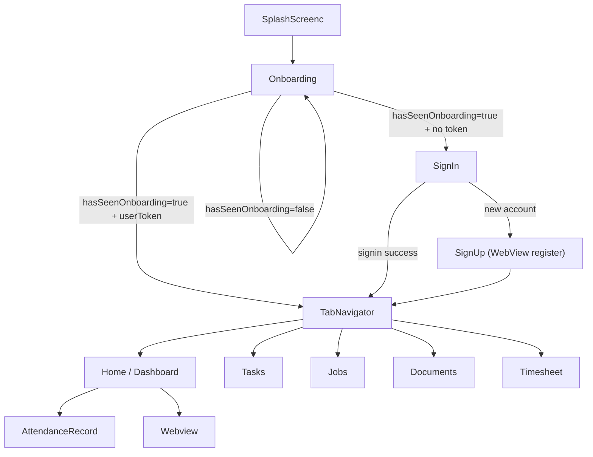

# CONTX Routing And Flow

  NAVIGATION
  82 STACK ROUTES
  REDUX CUSTOM TABS

## 1. Navigation Architecture
- Root navigator: `NavigationContainer` in `App.jsx`.
- Primary router: `src/navigation/StackNavigator.js` (`createNativeStackNavigator`).
- In-app tab shell: `src/navigation/TabNavigator.js` (not `createBottomTabNavigator`; custom Redux-driven tab view).
- Active tab state: `store/tabSlice.js` key `tab.screen`.

## 2. Tab Model
Configured tab names:
- `Tasks`
- `Jobs`
- `Home`
- `Documents`
- `Timesheet`

Rendered components in `TabNavigator`:
- `Tasks` -> `tabs/Mytask`
- `Jobs` -> `tabs/Myjob`
- `Home` -> `tabs/Dashboard`
- `Documents` -> `tabs/Documents`
- `Timesheet` -> `tabs/Timesheet`

## 3. Stack Route Inventory (Declared)

### Bootstrap/Auth
- `SplashScreenc`
- `Onboarding`
- `SignUp`
- `VerifyYourPhoneNumber`
- `SignIn`
- `SignInCode`
- `ForgotPassword`
- `NewPassword`
- `ForgotPasswordSentEmail`
- `ConfirmationCode`
- `SignUpAccountCreated`

### Core Shell and Profile
- `TabNavigator`
- `Profile`
- `EditPersonalInfo`
- `Notifications`

### Dashboard/Work
- `Dashboard`
- `Task`
- `MyJobs`
- `TimeSheet`
- `AttendanceRecord`
- `AnalogClock`
- `BackgroundExample`

### Documents and Forms
- `DocumentManager`
- `ViewCategory`
- `AddCategory`
- `AddDocument`
- `ViewDocument`
- `BocForm`
- `EodForm`
- `IncidentForm`

### Leads/CRM
- `Lead`
- `CampaignForm`
- `LeadForm`
- `ViewCampaign`
- `ViewLead`
- `EditCampaignForm`
- `EditLeadForm`
- `Call`
- `Email`
- `Minutes`
- `Cases`
- `Quote`
- `Deal`
- `Onboard`
- `Contract`
- `EditCall`
- `EditEmail`
- `EditMinutes`
- `EditCases`
- `EditQuote`
- `EditDeal`
- `EditContract`

### Banking/Card/Payment Demo Flows
- `OpenDeposit`
- `OpenMoneybox`
- `OpenNewCard`
- `CardMenu`
- `CardDetails`
- `ChangePinCode`
- `Payments`
- `MobilePayment`
- `FundTransfer`
- `IBANPayment`
- `TransactionDetails`
- `PaymentSuccess`
- `PaymentFailed`
- `OpenNewLoan`
- `TopUpPayment`
- `CreateInvoice`
- `InvoiceSent`
- `Statistics`
- `ExchangeRates`

### Web/Utility/Other
- `Webview`
- `CRM`
- `HRM`
- `Modules`
- `MyComponent`
- `ACCOUNT`
- `Mode`
- `Nexisbot`
- `Nextbot`
- `FAQ`
- `PrivacyPolicy`

## 4. Main User Journey

## 5. High-Frequency Navigation Edges (Observed)
- `Dashboard` -> `AttendanceRecord`
- `Dashboard` -> `Webview`
- `Dashboard` -> `MyJobs`
- `Dashboard` -> `Task`
- `Documents(tab)` -> `Lead`, `DocumentManager`, `Webview`
- `ViewLead` -> 9 downstream entity screens (`Call`, `Email`, `Minutes`, `Cases`, `Quote`, `Deal`, `Onboard`, `Contract`, edit variants)
- `Payments` -> `MobilePayment`, `FundTransfer`, `IBANPayment`
- `CardMenu` -> `CardDetails` and `OpenNewCard`

Raw source-backed transition file:
- `CONTX_ROUTE_TARGETS_RAW.txt`

## 6. Validation Status
Navigation target integrity check result:
- Total navigation targets scanned: 112
- Unresolved route names: `0`
- All route targets point to either declared stack routes or declared custom tab names.

## 7. Routing Characteristics
- Heavy centralization in `StackNavigator.js` means many routes are globally reachable.
- Custom tab implementation enables forced reload of active tab via local `reloadKey` increment.
- Some screens are reachable both via stack push and tab switch, creating parallel entry paths.
