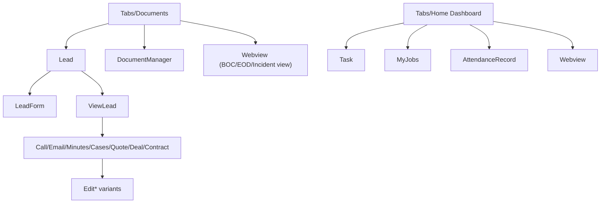

# CONTX Screen Catalog

  95 SCREENS
  CATEGORIZED
  COMPLEXITY HIGHLIGHTED

## 1. Inventory Totals
- Screen files under `src/screens`: 95
- Stack-declared route count: 82
- Tab folder screens (`src/screens/tabs`): 10+

Raw metrics source:
- `CONTX_SCREEN_METRICS_RAW.txt`

## 2. Highest Complexity Screens (by lines + API usage)
| Screen | Stack? | Lines | API Calls | Notes |
|---|---|---:|---:|---|
| `tabs/Dashboard` | Yes | 1196 | 11 | Central orchestration hub; jobs/tasks/forms/activity/webview bridge. |
| `MyComponent` | Yes | 287 | 4 | Legacy LAN API side menu module fetches. |
| `Webview` | Yes | 647 | 3 | Paginated BOC/EOD/Incident views + add/view toggles. |
| `LeadForm` | Yes | 611 | 3 | Rich lead creation with image/document handling. |
| `Modules` | Yes | 198 | 3 | Dynamic nested modules -> WebView routes. |
| `EodForm` | Yes | 815 | 2 | Large form workflow, project-team integration. |
| `IncidentForm` | Yes | 757 | 2 | Large incident submission workflow. |
| `AttendanceRecord` | Yes | 747 | 2 | Camera/location/clock-in-out/background lifecycle. |

## 3. Category Catalog

### Bootstrap + Authentication
- `SplashScreenc`
- `Onboarding`
- `auth/SignIn`
- `auth/SignUp`
- `auth/SignInCode`
- `VerifyYourPhoneNumber`
- `ConfirmationCode`
- `SignUpAccountCreated`
- `ForgotPassword`
- `NewPassword`
- `ForgotPasswordSentEmail`

### Home/Tabs and Activity
- `tabs/Dashboard`
- `tabs/Mytask`
- `tabs/Myjob`
- `tabs/Documents`
- `tabs/Timesheet`
- `tabs/Chatbot`
- `tabs/Faq`
- `tabs/Notification`
- `tabs/BottomTabBar`
- `tabs/Deposits` (not active in current custom tab list but present)

### Work/Attendance/Time
- `AttendanceRecord`
- `TimeSheet`
- `Task`
- `MyJobs`
- `Notifications`
- `AnalogClock`
- `Clock`
- `BackgroundExample`
- `BackgroundLocationService`

### Lead + Campaign + CRM Suite
- `Lead`
- `LeadForm`
- `EditLeadForm`
- `ViewLead`
- `CampaignForm`
- `EditCampaignForm`
- `ViewCampaign`
- `Call`, `EditCall`
- `Email`, `EditEmail`
- `Minutes`, `EditMinutes`
- `Cases`, `EditCases`
- `Quote`, `EditQuote`
- `Deal`, `EditDeal`
- `Contract`, `EditContract`
- `Onboard`

### Document Management
- `DocumentManager`
- `ViewCategory`
- `AddCategory`
- `AddDocument`
- `ViewDocument`
- `BocForm`
- `EodForm`
- `IncidentForm`

### Web/SaaS Bridges and Utility
- `Webview`
- `webview2` (legacy server-like script file)
- `Modules`
- `MyComponent`
- `Nexisbot`
- `Nextbot`
- `HRM`
- `CRM`
- `ACCOUNT`
- `Mode`

### Banking/Card/Payment Demo Screens
- `OpenDeposit`
- `OpenMoneybox`
- `OpenNewCard`
- `CardMenu`
- `CardDetails`
- `ChangePinCode`
- `Payments`
- `MobilePayment`
- `FundTransfer`
- `IBANPayment`
- `OpenNewLoan`
- `TopUpPayment`
- `TransactionDetails`
- `PaymentSuccess`
- `PaymentFailed`
- `CreateInvoice`
- `InvoiceSent`
- `Statistics`
- `ExchangeRates`

### Informational
- `FAQ`
- `PrivacyPolicy`
- `Loader`

## 4. Repeating Screen Archetypes

### Form screens (submit + list + edit)
Pattern present in `Call/Email/Minutes/Cases/Quote/Deal/Contract` families.

### Dashboard-style aggregator screens
- `tabs/Dashboard`
- `Notifications`
- `ViewLead`
- `ViewCampaign`

### WebView entry screens
- `auth/SignUp`
- `Webview`
- `tabs/Dashboard` (cookie bridge)
- `tabs/Chatbot`
- `Modules`

## 5. Screen Relationship Visual

